#tea
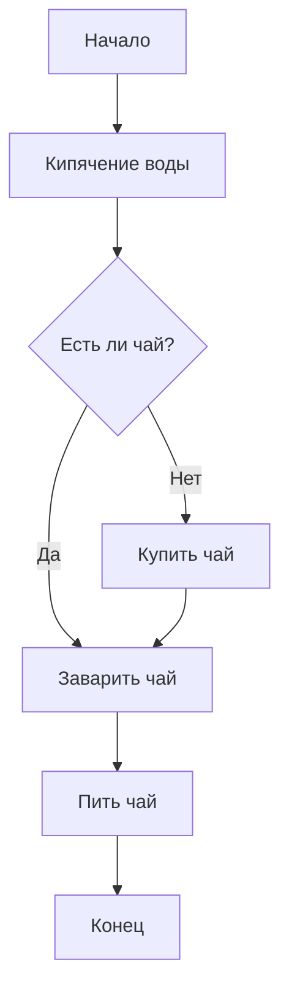
---
#taxi
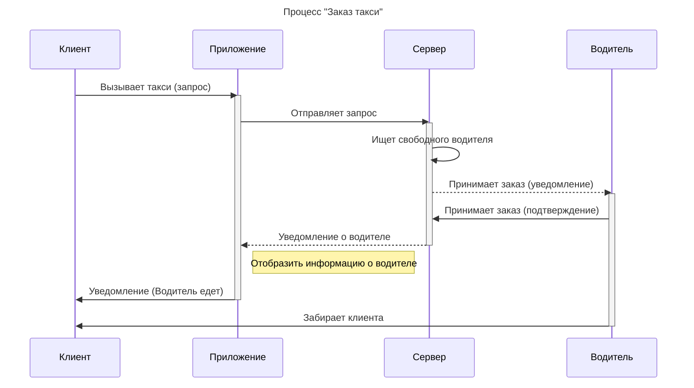
---
#Mid
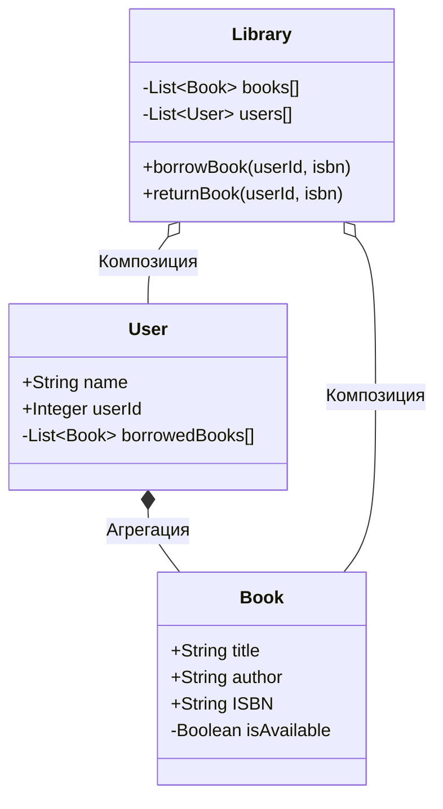
---
# Диаграмма Ганта
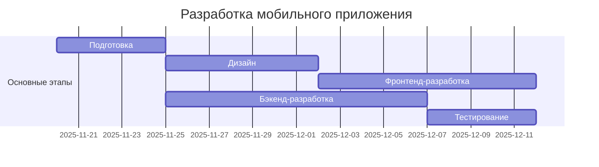
---
# Продвинутый
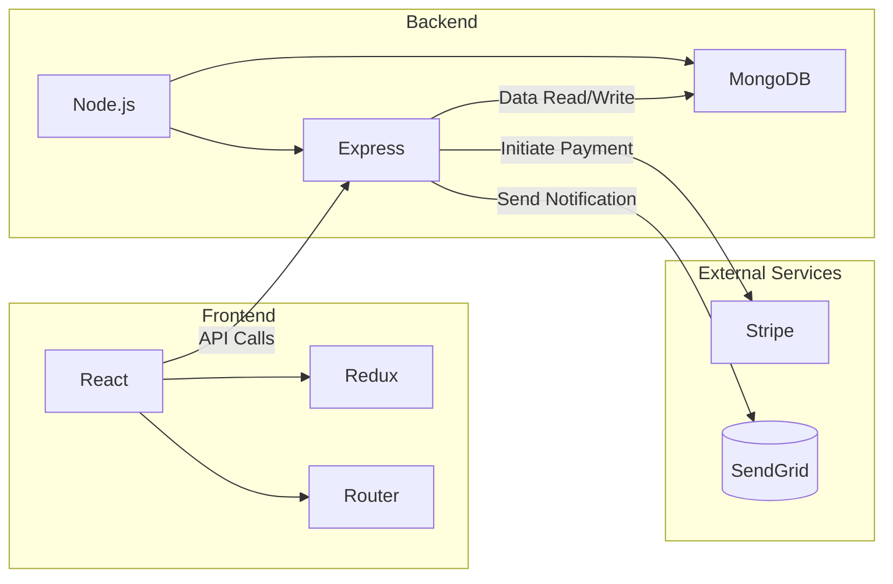
---
#   Диаграмма состояний
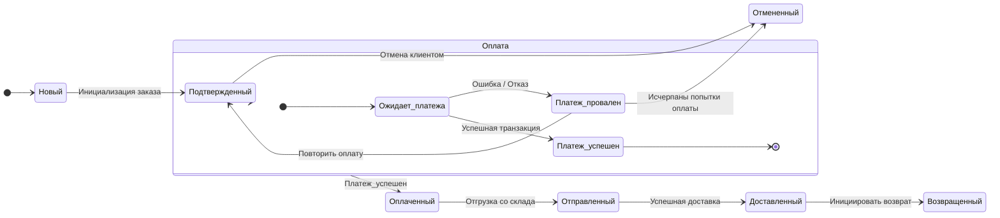
---
# Экспертный
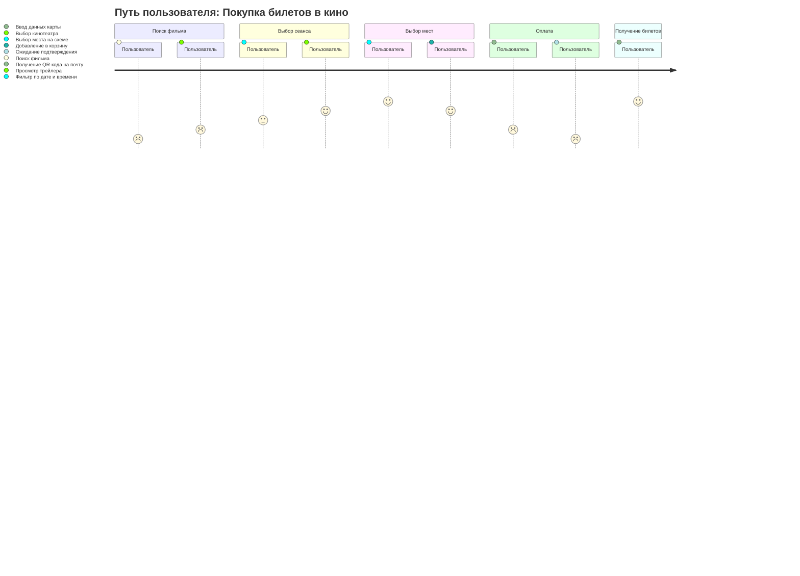
---
# ER-диаграмма базы данных
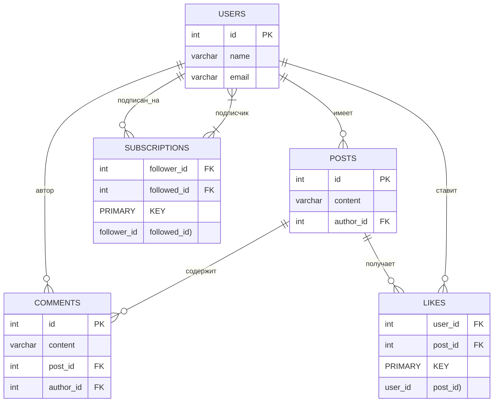
---
#Блок-схема процесса заказа
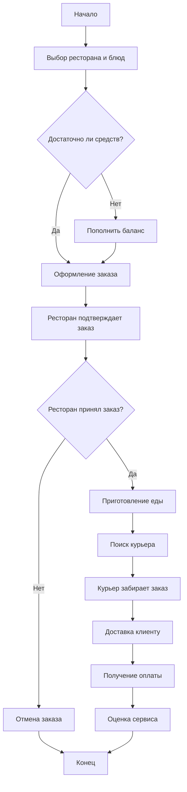
---
#Диаграмма последовательности
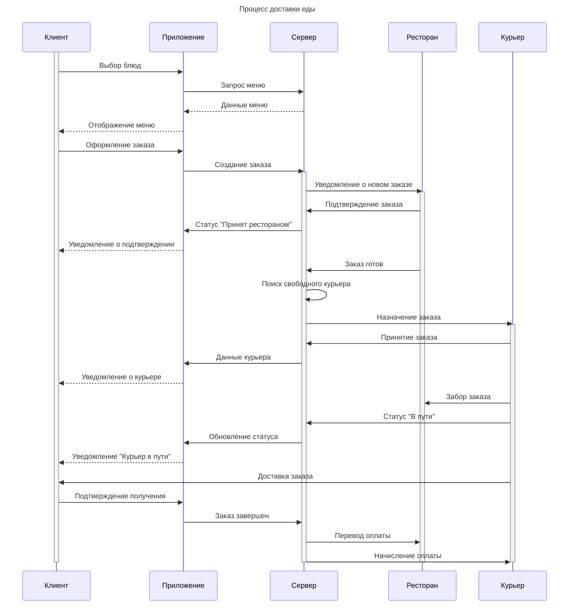
---
#Диаграмма классов системы
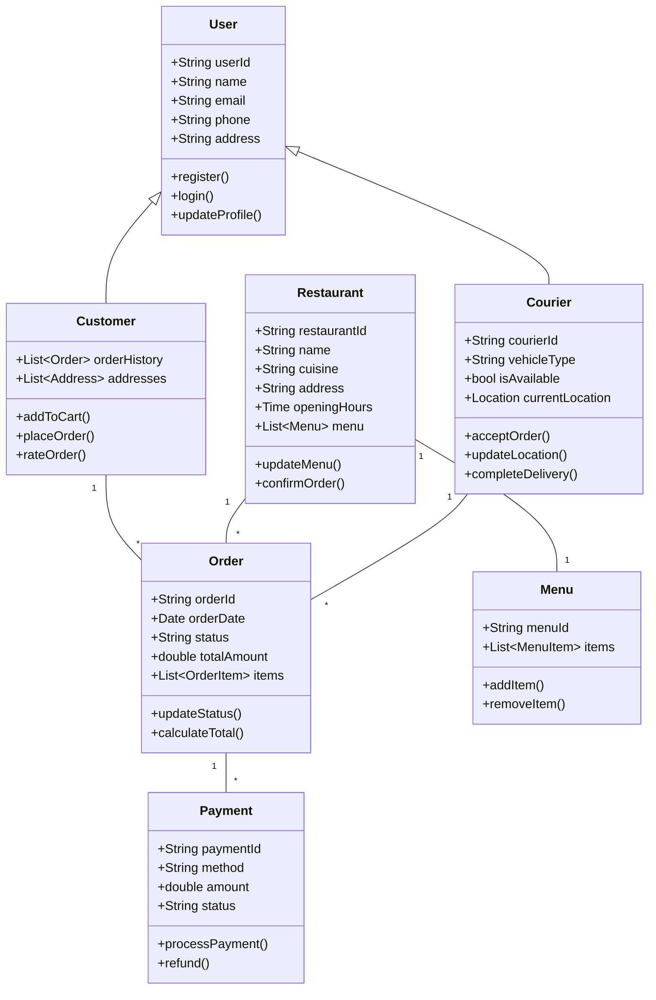
---
# ER-диаграмма базы данных
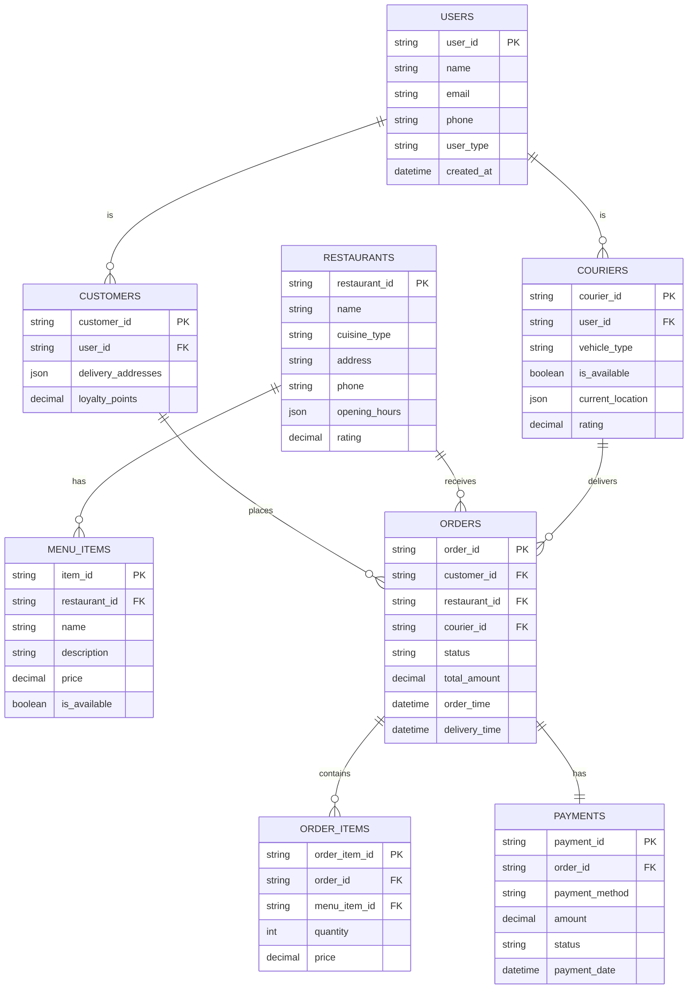
---
#User Journey клиента
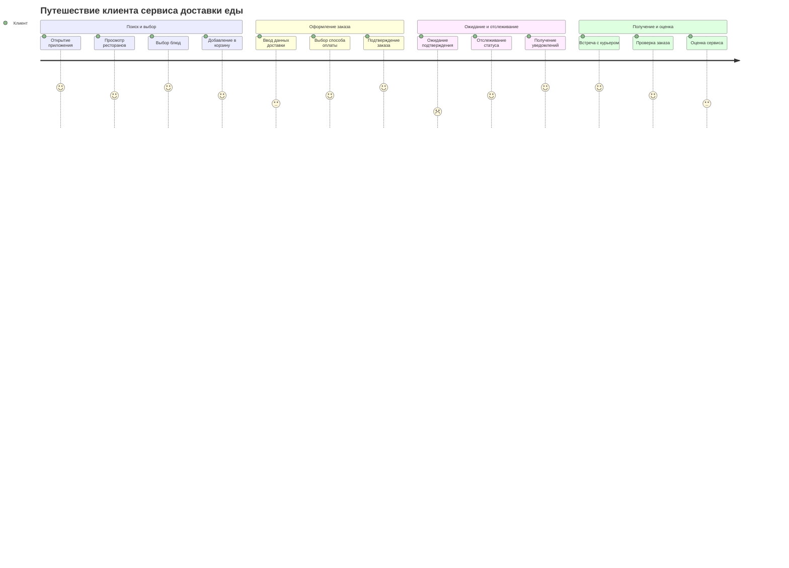
---
#Диаграмма Ганта разработки проекта
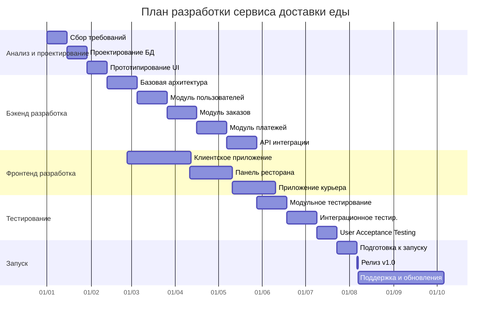
---
